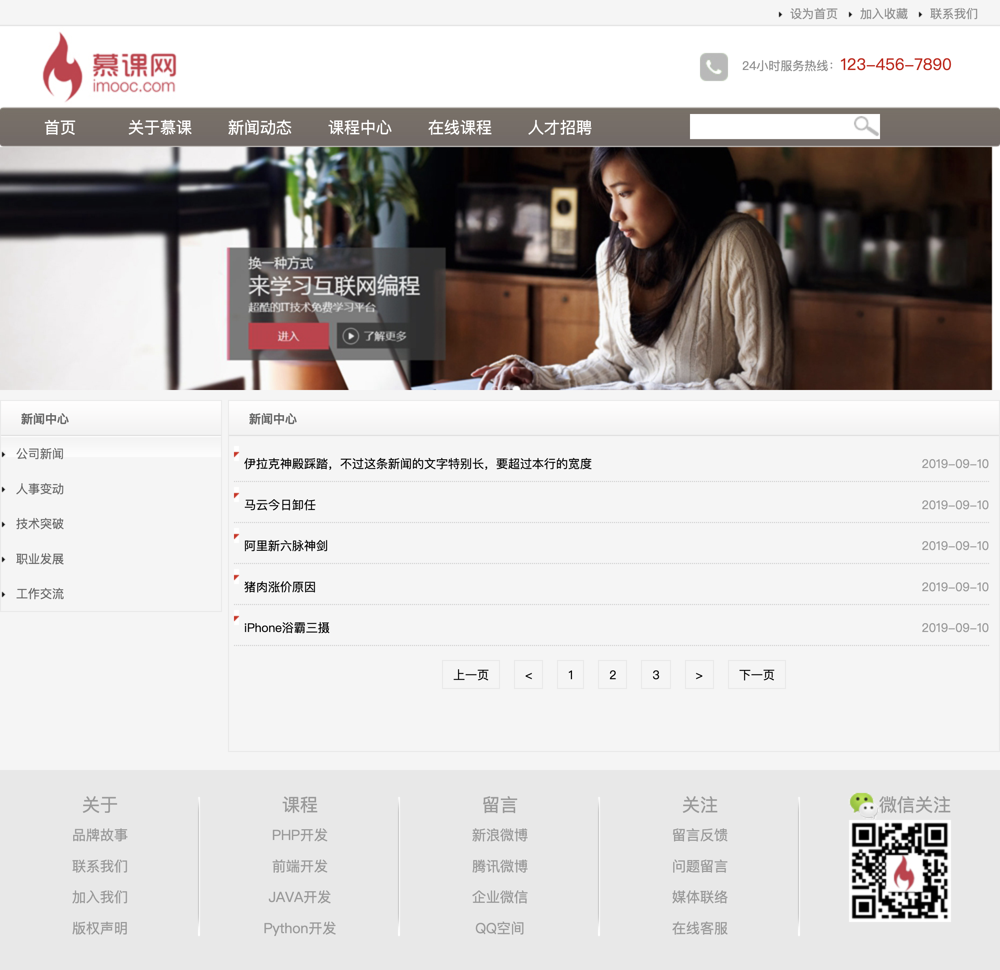
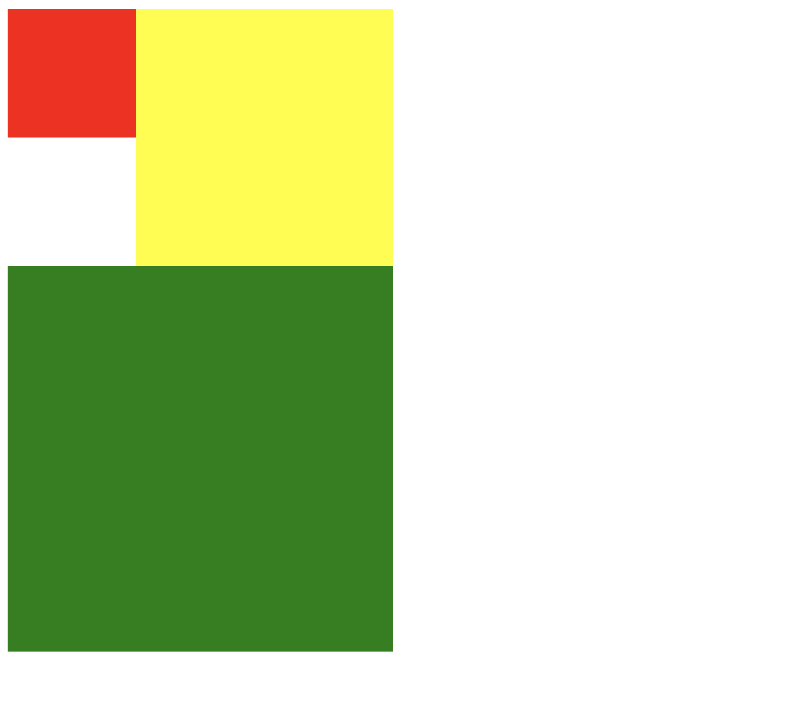
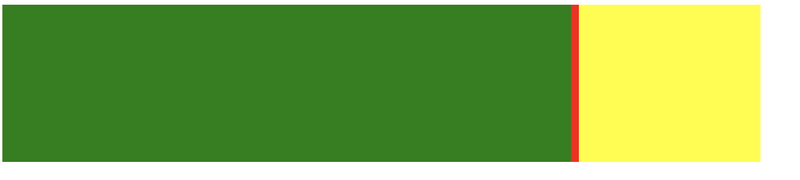
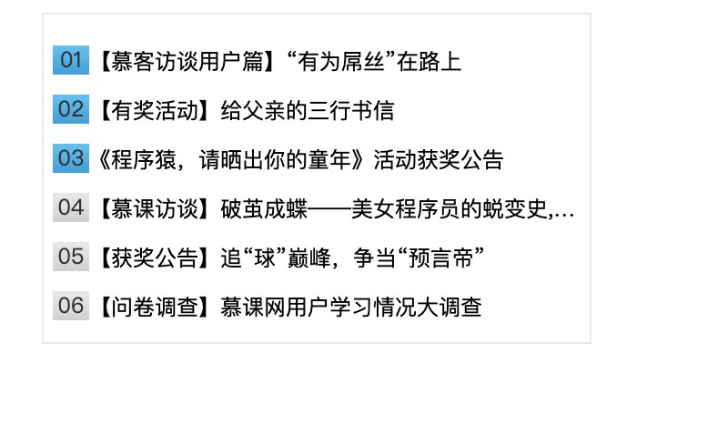
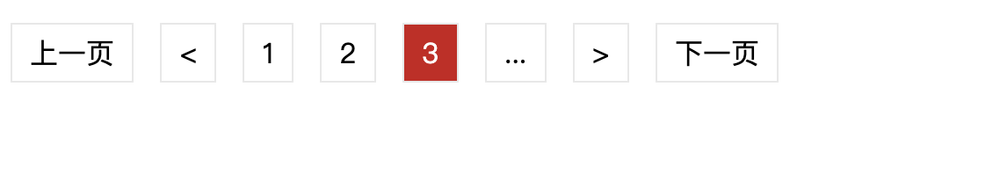
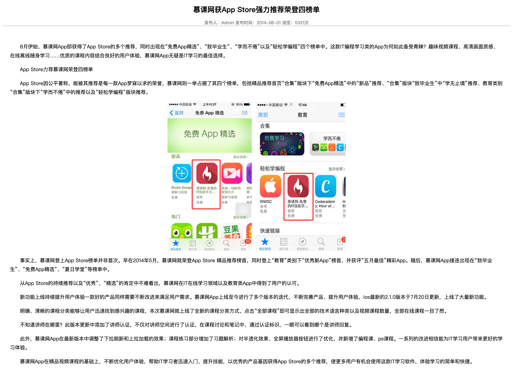

# 企业官网布局实例
一共3个页面：首页，新闻列表，新闻详情





# 基础回顾

## 1、盒子模型
eg:
margin: 1px 2xp          上下 左右  
margin: 1px 2xp 3px 4px  上右下左

外边距margin
内边距padding
边框border

width和height是指内容区域宽和高
增加内边距，边框和外边距不会影响内容区域尺寸，但是会增加元素框的总尺寸

盒子在页面中所占宽度 = 左边距 + 左边框 + 左填充 + 内容宽度 + 右填充 + 右边框 + 右边距
盒子在页面中所占高度 = 上边距 + 上边框 + 上填充 + 内容高度 + 下填充 + 下边框 + 下边距


## 2、浮动float
浮动的框可以向左向右移动，直到它的边缘碰到包含框或另一个浮动框的边框为止
浮动框不在文档普通流中，所以，文档的普通流中的块框表现的就像浮动框不存在一样
left 左浮动
right 右浮动
none 默认值，不浮动
inherit 从父元素继承


## 3、清除浮动clear
clear属性规定元素的哪一侧不允许其他浮动元素
left  左侧不允许浮动元素
right 右侧不允许浮动元素
both  左右两侧均不允许浮动元素
none  默认值，允许浮动元素出现在两侧
inherit 从父元素继承


eg: 通过clear使div元素不重叠

```html
<style>
.box1{
    width: 100px;
    height: 100px;
    float:left;
    background-color: red;
}

.box2{
    width: 200px;
    height: 200px;
    float:left;
    background-color: yellow;
}

.box3{
    width: 300px;
    height: 300px;
    background-color: green;
    clear: left;
}

</style>


<div class="box1"></div>
<div class="box2"></div>
<div class="box3"></div>
```


问题：
浮动会让元素塌陷。即被浮动元素的父元素不具有高度。例如一个父元素包含了浮动元素，它将塌陷具有零高度。

选项：
A在浮动元素后加个div设置clear: both; height:0,overflow:hidden
B使用clearfix;
C设置父元素浮动;

解析：
以上都对，浮动元素由于脱离了普通的文档流，不再占用原来文档中的位置，因此无法把父元素撑开。


eg: 通过clear使父元素撑开



```html
<html>
<head>
    <style>
        .main-box{
            background-color: red;
            width: 960px;
        }

        .left-box{
            background-color: green;
            float:left;
            width: 720px;
            height: 200px;
            
        }
        .right-box{
            background-color: yellow;
            float:right;
            width: 230px;
            height: 200px;
           
        }
        .clear{
            clear: both; 
            height:0;
            overflow:hidden
        }

    </style>
</head>
<body>

    <div class="main-box">

        <div class="left-box"></div>
        <div class="right-box"></div>
        <div class="clear"></div>

    </div>
    
</body>
</html>
```


list-style-type可以设置列表项目符号的不同样式，
如：
none表示无项目符号，
disc表示实心圆（默认值），
circle表示空心圆，
square表示实心方块等

实现把“图像”设置为列表中的项目符号方式：
background
list-style-image
background-image

示例：导航菜单栏


```html

<style>
ul li{
    width:50px;
    height:30px;
    list-style-type:none;

    /* 要想让列表在水平方向上排列，需要设置列表项浮动 */
    float:left;

    text-align:center;
    line-height:30px;
}

/* 由于a标签属于内联元素，无高度和宽度属性，*/
/* 因此控制鼠标经过状态改变背景颜色时，仅在有文字的地方显示背景颜色。 */
/* 解决的办法是把a标签变为块级元素，display:block  */
ul li a{
    display:block
}

ul li a:link, ul li a:visited{
    color:#000;
    text-decoration:none;
}

ul li a:hover, ul li a:active{
    color:#FFF;
    text-decoration:none;
    background-color:#BE3948;
}

</style>


<!-- 无序列表 -->
<ul>
    <li><a href="#">全部</a></li>
    <li><a href="#">初级</a></li>
    <li><a href="#">中级</a></li>
    <li><a href="#">高级</a></li>
</ul>  

```

焦点图
myfocus
http://demo.jb51.net/js/myfocus/
https://github.com/koen301/myfocus

教程：
http://demo.jb51.net/js/myfocus/tutorials.html

注意点：
1、焦点图初始化的id要与图片列表最外层id一致
2、图片列表外面，包裹一个class为pic的div


示例：TOP排行新闻列表



```html

<style type="text/css">

.topList{
    width:300px;
    height:180px;
    border: 1px solid #E8E8E8;
    margin:0 auto;
    font-size: 12px;
}

.topList ul{    
    padding-left: 0px;

}

.topList li{
    list-style-type:none;
    padding:5px;
    overflow: hidden;
    text-overflow: ellipsis;
    white-space: nowrap;
}


.topList p{
    /*float:left;*/
    display: inline;
}

/*em背景图片设置*/
.topList em{
    font-style: normal;

    /* em为内联元素，要把他改为块级元素后，设置的宽度和高度才有效 */
    display:block;
    float:left;

    width:20px;
    height:16px;
    
    /*水平垂直居中*/
    line-height:16px;
    text-align:center;

    color:#333;
    background-image:url("http://img.mukewang.com/53cf0fa20001d3dc00200032.jpg");
    background-repeat:no-repeat;
    background-position-y:-16px;
}

.topList .top em{
    background-position-y: 0;
}


/*设置超链接4种状态*/
.topList a:link, .topList a:visited{
    color:#000;
    text-decoration:none;
}

.topList a:hover, .topList a:active{
    color:#F00;
    text-decoration:none;
}

</style>


<div class="topList">
    <ul>
        <li class="top">
            <em>01</em>
            <p><a href="http://www.imooc.com/" >【慕客访谈用户篇】“有为屌丝”在路上</a></p>
        </li>
        <li class="top">
            <em>02</em>
            <p><a href="http://www.imooc.com/">【有奖活动】给父亲的三行书信</a></p>
        </li>
        <li class="top">
            <em>03</em>
            <p><a href="http://www.imooc.com/">《程序猿，请晒出你的童年》活动获奖公告</a></p>
        </li>
        <li>
            <em>04</em>
            <p><a href="http://www.imooc.com/">【慕课访谈】破茧成蝶——美女程序员的蜕变史,美女程序员的蜕变史</a></p>
        </li>
        <li>
            <em>05</em>
            <p><a href="http://www.imooc.com/">【获奖公告】追“球”巅峰，争当“预言帝”</a></p>
        </li>
        <li>
            <em>06</em>
            <p><a href="http://www.imooc.com/">【问卷调查】慕课网用户学习情况大调查</a></p>
        </li>
    </ul>
</div>

```

## 样式优先级
1、行内样式优先级高于外部样式
2、行内样式适合于写少量样式的地方


display：inline-block是兼顾内联元素和块级元素的属性

块元素和内联元素的基本差异是块元素一般都从新行开始。
可以通过设置display属性实现块级元素和内联元素的相互转变


## 分页按钮


```html
<style>
.page a{
    display: inline-block;
    border: 1px solid #E8E8E8;
    margin: 5px;
    padding: 5px 10px;
    text-decoration: none;
}

.page a:link, .page a:visited{
    color: #000;
}

.page a:hover, .page a:active{
    color: #FFF;
    background-color: #CC1B1B;
}
</style>

<div class="page">
    <a href="#">上一页</a>
    <a href="#">&lt;</a>
    <a href="#">1</a>
    <a href="#">2</a>
    <a href="#">3</a>
    <a href="#">...</a>
    <a href="#">&gt;</a>
    <a href="#">下一页</a>
</div>
```

首行缩进

text-indent用来规定文本块中首行文本的缩进，
但是px是绝对单位，20px不一定正好是两个字符，而em是相对单位，
1em的大小是当前1个字体的大小，因此2em正好是两个字符。
另提示：text-indent的值允许负值，因此如果想隐藏某个div中的文字可以这样写text-indent:-9999px.


新闻排版实例



```html
<!doctype html>
<html>
<head>
<meta charset="utf-8">
<title>无标题文档</title>
<style>
/*在此定义相关样式*/
.newsBox{
    min-width:300px;
    
}
.newsTitle{
    text-align: center;
    font-size:20px;
}

.newsInfo{
    color: #666;
    text-align: center;
    font-size:12px;
    border-bottom: 1px dotted #666;
}

.newsContent{
    text-indent:2em;
    line-height: 25px;
    font-size:14px;
    padding: 20px;
}

.newsContent img{
    display: block;
    margin: 0 auto; 
}


</style>
</head>

<body>
<div class="newsBox">
<h1 class="newsTitle">慕课网获App Store强力推荐荣登四榜单</h1>
<p class="newsInfo">发布人：Admin 发布时间：2014-08-01 浏览：5321次</p>
<div class="newsContent">
<p> 8月伊始，慕课网App即获得了App Store的多个推荐，同时出现在“免费App精选”、“致毕业生”、“学而不倦”以及“轻松学编程”四个榜单中。这款IT编程学习类的App为何如此备受青睐？趣味视频课程、高清画面质感、在线离线随身学习……优质的课程内容结合良好的用户体验，慕课网App无疑是IT学习的最佳选择。</p>
<p> App Store力荐慕课网荣登四榜单</p>
<p>App Store因公平著称，能被其推荐是每一款App梦寐以求的荣誉，慕课网则一举占据了其四个榜单，包括精品推荐首页“合集”版块下“免费App精选”中的“新品”推荐、“合集”版块“致毕业生”中“学无止境”推荐、教育类别“合集”版块下“学而不倦”中的推荐以及“轻松学编程”版块推荐。</p>
<p></p>
<p>事实上，慕课网登上App Store榜单并非首次。早在2014年5月，慕课网就荣登App Store 精品推荐榜首，同时登上“教育”类别下“优秀新App”榜首，并获评“五月最佳”精彩App。随后，慕课网App接连出现在“致毕业生”、“免费App精选”、“夏日学堂”等榜单中。</p>
<p>从App Store的持续推荐以及“优秀”、“精选”的肯定中不难看出，慕课网在IT在线学习领域以及教育类App中得到了用户的认可。</p>
<p>新功能上线持续提升用户体验一款好的产品同样需要不断改进来满足用户需求。慕课网App上线至今进行了多个版本的迭代，不断完善产品、提升用户体验，ios最新的2.1.0版本于7月20日更新，上线了大量新功能。</p>
<p>明确、清晰的课程分类能够让用户迅速找到感兴趣的课程，本次慕课网就上线了全新的课程分类方式，点击“全部课程”即可显示出全部的技术语言种类以及视频课程数量，全部在线课程一目了然。</p>
<p>不知道讲师在哪里？此版本更新中添加了讲师认证，不仅对讲师空间进行了认证，在课程讨论和笔记中，通过认证标识，一眼可以看到哪个是讲师回复。</p>
<p>此外，慕课网App在最新版本中调整了下拉刷新和上拉加载的效果；课程练习部分增加了习题解析；对半透化效果、全屏播放器按钮进行了优化，并新增了编程课、ps课程。一系列的改进相信能为IT学习用户带来更好的学习体验。</p>
<p>慕课网App在精品视频课程的基础上，不断优化用户体验，帮助IT学习者迅速入门、提升技能，以优秀的产品基因获得App Store的多个推荐，使更多用户有机会使用这款IT学习软件，体验学习的简单和快捷。</p>
</div>
</div>
</body>
</html>
```

有一个不错的整理
https://github.com/logan70/enterprise-website


